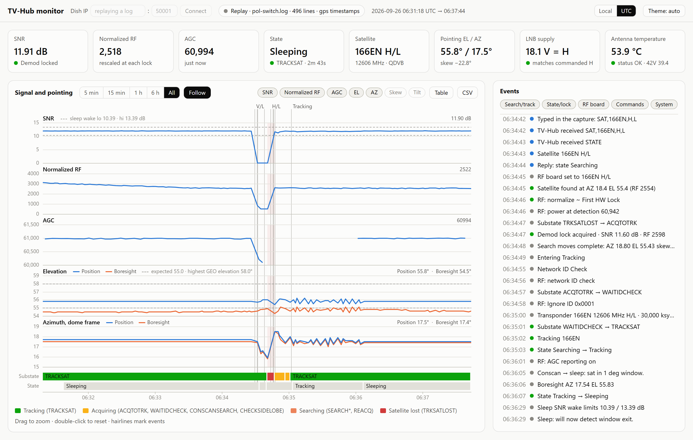

# KVH Dish Monitor

A live dashboard for a KVH TracVision TV6 satellite antenna, built on the TV-Hub's
maintenance port (TCP 50001). It includes a parser for the antenna's telemetry, a small
bridge that talks to the TV-Hub, and a browser GUI with strip charts, events, transponder
config and health.

It needs only Python 3, with no packages to install (tested on 3.12 and 3.14). The GUI is
one HTML file with no external dependencies, so it works offline.

Unofficial: not affiliated with or endorsed by KVH Industries.

<picture>
  <source media="(prefers-color-scheme: dark)" srcset="docs/screenshot-dark.png">
  
</picture>

*Replaying `samples/pol-switch.log` (times in UTC). Switching IS-19 to vertical loses the
signal, and switching back to horizontal re-acquires it.*

## Run it

```
python tvhub_server.py                                  # live: connects to the dish, opens http://127.0.0.1:8650/
python tvhub_server.py --read-only                      # live, never sends anything (not even web-service reads)
python tvhub_server.py --replay samples/pol-switch.log  # look at a saved capture (add --speed 10 to watch it play)
```

Type the dish's TV-Hub address in the **Dish IP** box at the top of the page and press
Connect. A new address starts a fresh session (the old dish's history and satellites are
dropped) and is saved to `tvhub_config.json`, so the next launch reconnects there.
`--host` on the command line overrides the saved address for one run. The default is
192.168.50.214.

### Open it from other devices

```
python tvhub_server.py --lan              # also serve the page on the local network, as http://kvh.local/
python tvhub_server.py --lan --name dish  # announce http://dish.local/ instead
python tvhub_server.py --local            # back to this PC only
```

`--lan` serves the page on port 80 on all network interfaces. The bridge then announces
`kvh.local` itself with multicast DNS, so phones, tablets and other computers on the same
network can open **http://kvh.local/**. The PC's own name (`http://<pc-name>.local/`) and
its IP address work too. The setting is saved in `tvhub_config.json`, so a double-clicked
`tvhub_server.py` starts the same way. On this PC, use `http://localhost/` or
`http://kvh.localhost/`.

Windows asks once whether Python may accept connections: allow it on private networks.
Anyone on the network can then use the page, including its commands. The bridge still
answers only requests addressed to one of its own names or addresses, which stops a web
page on another site from reaching it through DNS rebinding.

Live sessions are logged to `logs/tvhub-YYYYMMDD-HHMMSS.log` with arrival timestamps.
Those logs, plain `ncat -o` captures, and the TV-Hub's own serial log export
(`IPACU.serial.log`, downloadable from its web interface) all work with `--replay`:

- **ncat captures:** timestamps are interpolated from the `$GPRMC` fixes.
- **The hub's export:** keeps the hub's own UTC timestamps. The monitor also shows the
  status snapshot at its top, such as hub temperature and the 42 V feed at the hub against
  what reaches the antenna. The export's configuration block, which holds the owner's
  registration details, is skipped. Don't share that file publicly.

### The TV-Hub's web service

The bridge also polls the TV-Hub's own web service (`POST /webservice.php` on port 80, the
same XML interface the hub's web pages use) for things port 50001 never reports:

- the hub's three status lights and their messages
- hub and antenna supply rails and temperatures
- the LNB setting
- the hub's copy of each favourite satellite's settings (transponders, skew offset, LO
  values), compared with the antenna's SATCONFIG
- the hub's alert log, such as "Polarization and Band selection failure" and checksum
  reloads

It polls only read-only messages (`antenna_status`, `power`, `antenna_versions`,
`get_antenna_config`, `ophours`, `get_satellite_list`, `get_satellite_params`,
`get_event_history_count`, `get_recent_event_history`, `get_autoswitch_status`), one at a
time, at most one a second.

The one change it makes is **switching satellite**. The Commands card lists the TV-Hub's
installed group, and clicking a satellite (after a confirmation) sends `select_satellite`
with `install=N`, the same request the hub's own Satellites page sends. It works only for a
satellite in that group, only while autoswitch is off, and at most once every 10 s. It never
reinstalls (`install=Y`).

Every `set_*` message, `reboot`, `clear_event_history` and the messages that return the
owner's registration or network settings are refused in `tvhub_webservice.py` before a
request is built. The GPS position, serial numbers and modem address in the replies are
dropped before anything is logged. `--no-hub-web` turns this off, and `--read-only` implies
it.

## What the page shows

- **Tiles:** SNR and demod lock, normalized RF, AGC, state/substate, satellite and
  transponder, pointing, LNB supply voltage (13 V = V, 18 V = H) with a check against the
  commanded polarization, and antenna temperature/status.
- **Strip charts:** SNR, normalized RF, AGC, elevation and azimuth, plus optional skew and
  boresight tilt. Elevation and azimuth show both the antenna's position (`+POS`) and its
  boresight (`+BST`); the TV-Hub's status page names the three `+BST` values boresight
  azimuth, elevation and tilt. Under them is a substate band (green tracking, amber acquiring,
  orange searching, red lost) and a state band. Hairlines mark pol/band changes, lock and
  unlock, search modes, found, lost, wake and restarts. Reference lines show the sleep
  wake limits, the search threshold, the expected elevation and the highest GEO elevation
  for your latitude. Drag to zoom, double-click to reset, hover or use the arrow keys for
  values. **Table** lists the ticks and **CSV** downloads them.
- **Events:** search, tracking, state and lock changes, the sidelobe check (new beam,
  main beam), RF board messages, commands and replies, and bridge notes. When satellite
  settings change on the TV-Hub, it explains the checksum mismatch and the reinstall and
  restart that follow, and shows which slots changed from what to what. A find far from
  the satellite's expected elevation is flagged as a likely sidelobe.
- **Cards:**
  - the current transponder (`RF: FREQ`)
  - the SATCONFIG slots, comparing the RF board's copy with the antenna's
  - the installed satellites, with their longitude and skew offset and the antenna's look
    angles next to ones computed from the GPS fix
  - search and sleep parameters, supply rails, boot self-tests, versions and GPS
- **Raw stream:** every line with the parser's classification. Unparsed lines are
  highlighted so new line types stand out.

## Commands (allowlist)

The TV-Hub's maintenance port is unauthenticated: anything on the LAN can send it
commands, including ones that restart or erase the antenna. Keep it off the internet.

The bridge enforces the allowlist itself; the GUI buttons are only a convenience. It
sends only:

- **Read-only queries:** the bare words the TV-Hub sends at boot (`STATE SAT SATINSTALL
  VERSION GPS HOURS STATUS ANTLNB SIDELOBE SLEEP SEARCHTIMEOUT HW @VER @FPGAVER =SERNUM`),
  plus `HELP`, `TGTLOCATION` and `SIGLEVEL` from the antenna's own command list.
- **Polarization and band:** `SAT,<sat>,<H|V>,<L|H>`, only for a satellite already seen in
  this session's telemetry. The GUI asks you to confirm these.
- **Halting and resuming:** `HALT`, which stops tracking and puts the antenna in Idle mode
  (the GUI asks first), and `TRACK`, which resumes. After a reboot the antenna answers
  `TRACK requires Debug mode.` until it gets `DEBUGON`, so **Resume tracking** sends
  `DEBUGON` then `TRACK`. (`DEBUGON` only turns on extra diagnostic lines.)
- **Manual pointing, only while the antenna reports Idle:** `AZ,<0-3599>` and
  `EL,<150-600>` (tenths of a degree, antenna frame), and the 0.1° steps `8` (up), `2`
  (down), `4` (counter-clockwise) and `6` (clockwise). The Commands card has a panel for
  this: Halt/Resume, go to AZ/EL, a jog pad (arrow keys work when it has focus) that can
  read `SIGLEVEL` after each move, a table of the signal readings with the strongest one
  highlighted, the antenna's own target for each installed satellite (`TGTLOCATION`) with
  a **Use** button that fills in the AZ/EL boxes, and a box showing the antenna's replies.
  **Fill expected** uses the antenna's target when it has one, otherwise the GPS fix and
  the orbit geometry. The antenna sends no `+POS` while Idle, so the panel shows the
  position it accepted instead, and the tiles say when their `+POS` value is stale.
  `SIGLEVEL` is on the same scale as the RF value in `+POS` (500 is the noise floor); the
  latest reading is shown large next to the jog pad and in the RF tile, and every reading
  is a dot on the RF, elevation and azimuth strip charts (hover one for its value and
  position).

The page is read from disk every time it loads, but the bridge only changes when it is
restarted. If the page is newer than the running bridge (or the bridge's code changed on
disk after it started), a banner at the top asks you to restart `tvhub_server.py`.

It refuses everything else (`SMACK`, `ZAP`, `CLEAREE`, `=CAL…`, `@SAVE`, …) and logs the
refusal. The limit is two commands per second, and nothing is sent except in response to a
click. The web server listens on 127.0.0.1 only and rejects cross-site requests.

`HELP` only answers in Idle mode. `SMACK` resets the antenna's satellite data and GPS; never
send it.

## Sample captures

Both are real captures from a TV6. The GPS position has been moved to a dummy point and
the serial number blanked.

- `samples/pol-switch.log`: tracking IS-19 (166°E). Switching to vertical loses the
  signal, and switching back to horizontal re-acquires it.
- `samples/install-restart.log`: a satellite install (SATSETUP/SATCONFIG), a `ZAP`
  restart with the boot self-tests, and a search that finds USER6I.
- `samples/sat-change.log`: USER6I edited on the TV-Hub. The checksum mismatch starts a
  reinstall and restart. The antenna then re-acquires on vertical, and the sidelobe check
  confirms the main beam.

## Parser CLI

```
python tvhub_parser.py samples/pol-switch.log                  # line counts by kind + any unparsed lines
python tvhub_parser.py samples/pol-switch.log --events         # event timeline
python tvhub_parser.py samples/pol-switch.log --csv ticks.csv  # +POS/+BST ticks as CSV
python tvhub_parser.py samples/pol-switch.log --json           # every record as JSON lines
```

## Tests

```
python -m unittest discover -s tests
```

The server tests use a fake TV-Hub on localhost. They check that only allowlisted bytes
ever reach the socket and that nothing goes to the old dish after an address change. The
web-service tests use a fake `/webservice.php` and check that only the read-only messages
are ever requested.
